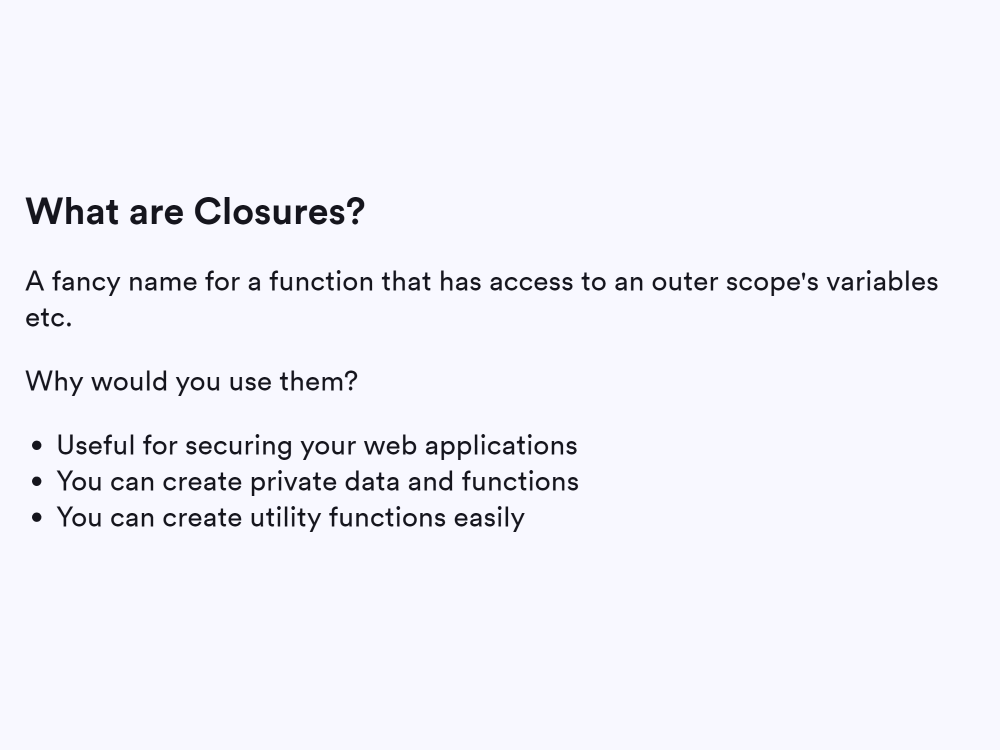

# JS Advance
---
## Scope:

- ### Functional Scoping
- ### Block Scoping

---

## Hoisting:

## Closures:

## IIFE:

---
#### Additional Resources:
- [Scope](https://developer.mozilla.org/en-US/docs/Glossary/Scope)
- [Hoisting](https://developer.mozilla.org/en-US/docs/Glossary/Hoisting)
- [Closures](https://developer.mozilla.org/en-US/docs/Glossary/Hoisting)
